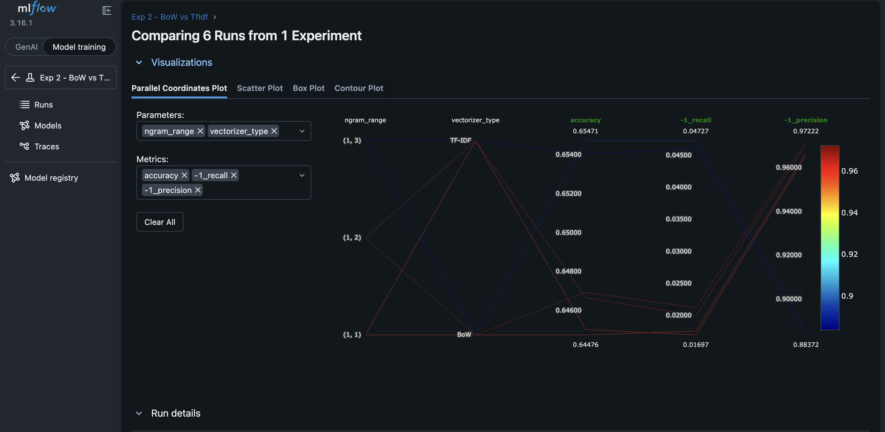

# 📊 YouTube Sentiment Analysis & Chrome Extension

[](https://www.python.org/)
[](https://flask.palletsprojects.com/)
[](https://lightgbm.readthedocs.io/)
[](https://dvc.org/)
[](https://mlflow.org/)
[](https://www.docker.com/)
[](https://github.com/amangupta982/Youtube-Sentiment-Analysis/actions)

An end-to-end Machine Learning pipeline and Chrome Extension for analyzing the sentiment of YouTube comments in real-time. This project features a robust data processing and modeling pipeline tracked by **DVC** and **MLflow**, serving predictions via a **Flask API**.

---

## 📑 Table of Contents
- [🌟 Key Features](#-key-features)
  - [Chrome Extension](#️-chrome-extension)
  - [Machine Learning Pipeline](#-machine-learning-pipeline)
  - [MLOps & Tracking](#️-mlops--tracking)
- [📈 Model Performance & Hyperparameter Tuning](#-model-performance--hyperparameter-tuning)
- [🚀 Setup & Installation](#-setup--installation)
- [🐳 Running with Docker](#-running-with-docker)
- [⚙️ CI/CD Pipeline](#️-cicd-pipeline)
- [🌐 Flask API Backend](#-flask-api-backend)
- [🧩 Installing the Chrome Extension](#-installing-the-chrome-extension)

---

## 🌟 Key Features

### 🖥️ Chrome Extension
The built-in Chrome Extension interacts with the Flask backend to fetch comments from the current video and display rich analytics instantly:
- **Comment Analysis Summary:** View key metrics like Total Comments, Unique Commenters, Average Comment Length, and an overall Average Sentiment Score (normalized out of 10).
- **Sentiment Distribution:** Breakdown of Positive, Neutral, and Negative comments.
- **Sentiment Trend Over Time:** A trend graph showing how sentiment percentages have shifted over the lifespan of the video.
- **Comment Wordcloud:** A visually engaging word cloud highlighting the most frequent and impactful words used by viewers.
- **Top Comments:** Quickly browse the top 25 comments ranked by engagement, alongside their individual sentiment scores.

### 🧠 Machine Learning Pipeline
- Natural Language Processing (NLP) pipeline with **TF-IDF Vectorization** (unigrams to trigrams).
- Model building and hyperparameter tuning utilizing **LightGBM** and other algorithms.
- **Handling Imbalanced Data** using techniques like SMOTE and class weights.

### 🛠️ MLOps & Tracking
- **DVC (Data Version Control):** Tracks data pipelines, caching, and reproducibility.
- **MLflow:** Tracks experiments, logs model parameters, metrics (Precision, Recall, F1-Score), confusion matrices, and model artifacts.

---

## 📈 Model Performance & Hyperparameter Tuning

To achieve the best model performance, various hyperparameter combinations were tested and tracked using MLflow. The parallel coordinates plot below illustrates how we decided on the optimal hyperparameters.



*Comparison of 6 runs from 1 experiment evaluating `ngram_range` and `vectorizer_type`. The plot demonstrates that using **TF-IDF** with an `ngram_range` of **(1, 3)** yields the highest accuracy (0.654).*

---

## 🚀 Setup & Installation

### 1. Environment Setup
Create and activate a new Conda environment, then install the dependencies:
```bash
conda create -n youtube python=3.11 -y
conda activate youtube
pip install -r requirements.txt
```

### 2. Configure AWS (For MLflow Remote Tracking)
If using an AWS EC2 instance for the MLflow tracking server:
```bash
aws configure
```

### 3. DVC Pipeline
The project pipeline (data ingestion -> preprocessing -> model building -> evaluation) is managed by DVC.
```bash
# Initialize DVC (if not already initialized)
dvc init

# Reproduce the entire pipeline end-to-end
dvc repro

# Visualize the pipeline DAG
dvc dag
```

---

## 🐳 Running with Docker

You can also run the Flask Backend application effortlessly using Docker. Ensure Docker is installed on your machine.

### 1. Build the Docker Image
```bash
docker build -t youtube-sentiment-api .
```

### 2. Run the Container
```bash
docker run -p 5001:5001 youtube-sentiment-api
```
The Flask API will now be accessible at `http://localhost:5001`.

---

## ⚙️ CI/CD Pipeline

This repository is equipped with a robust Continuous Integration (CI) pipeline powered by **GitHub Actions**. 

On every `push` and `pull_request` to the `main` branch, the pipeline automatically:
1. Checks out the source code.
2. Sets up Python 3.11.
3. Installs all project dependencies from `requirements.txt`.
4. Builds the Docker container to guarantee that the application can be packaged and deployed reliably without errors.

Check the badge at the top of this README to see the real-time build status!

---

## 🌐 Flask API Backend

The backend is powered by Flask, serving the trained LightGBM model. Ensure the Flask server is running to power the Chrome Extension!

```bash
python flask_app/app.py
```

### API Usage Example (Postman)

**Endpoint:** `POST http://localhost:5001/predict` *(Note: Check your specific port configuration, usually 5000 or 5001)*

**Request Body (JSON):**
```json
{
    "comments": [
        "This video is awesome! I loved it a lot.", 
        "Very bad explanation. Poor video."
    ]
}
```

---

## 🧩 Installing the Chrome Extension

To use the Chrome Extension locally:
1. Open Google Chrome and navigate to `chrome://extensions/`
2. Enable **Developer mode** (toggle in the top right corner).
3. Click **Load unpacked**.
4. Select the `yt-chrome-plugin-frontend` directory within this project.
5. Open any YouTube video and click the extension icon to see live insights!